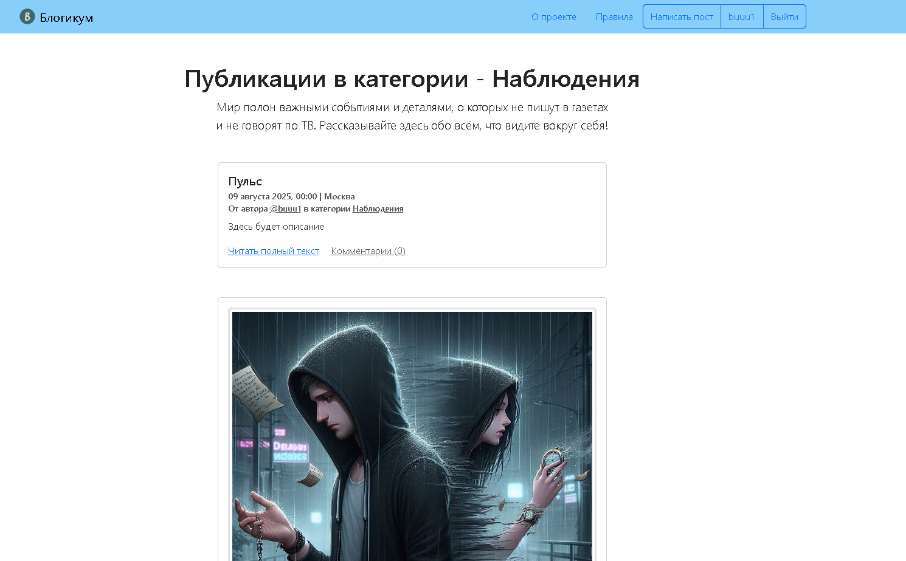
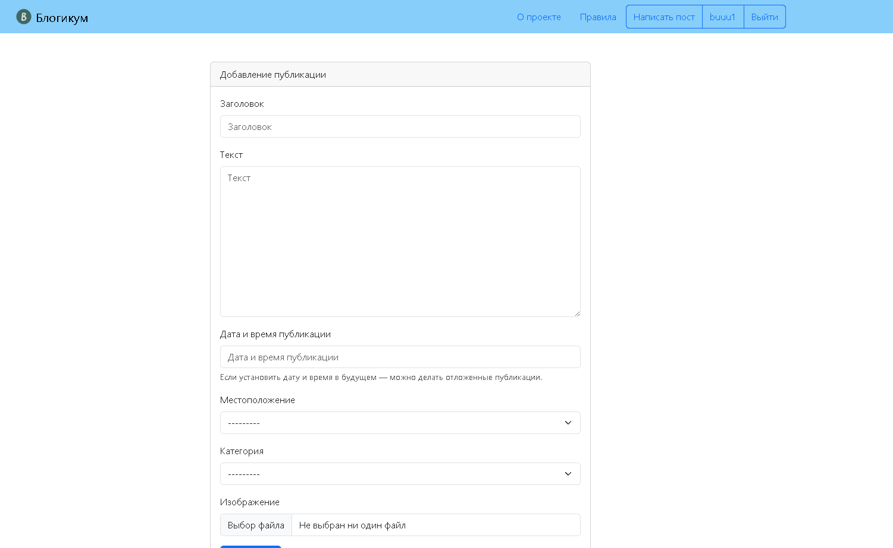
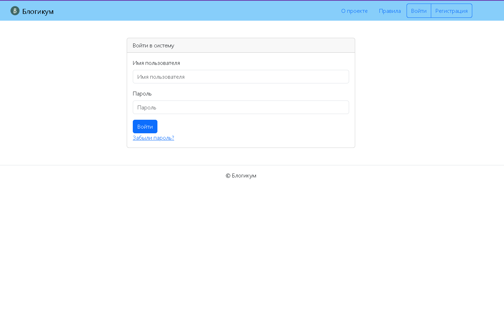
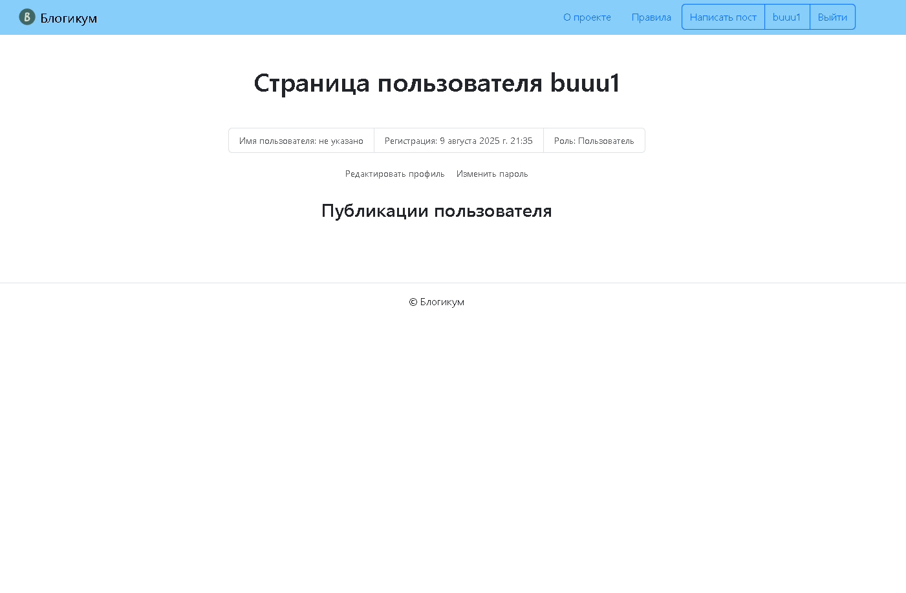

# Blogicum 📝


Blogicum - это блог-платформа, разработанная на Django. Проект позволяет пользователям создавать, редактировать и публиковать посты, комментировать записи других авторов и управлять категориями контента.

## 📸 Скриншоты

### Страница категории


### Создание поста


### Страница входа


### Профиль пользователя


## 🚀 Функциональность

- 👤 Регистрация и аутентификация пользователей
- ✍️ Создание, редактирование и удаление постов
- 🏷️ Категоризация постов
- 📍 Привязка постов к локациям
- 💬 Система комментариев
- 🖼️ Поддержка загрузки изображений
- 📝 Редактирование профиля пользователя

## 🛠 Технологический стек

- **Python 3.10+**
- **Django 5.1.1**
- **Django Bootstrap 5**
- **Pillow** - для работы с изображениями
- **SQLite** - база данных
- **pytest** - тестирование
- **flake8** - линтер кода

## 📋 Предварительные требования

- Python 3.10 или выше
- pip (менеджер пакетов Python)
- Git

## 🚀 Установка и запуск

1. **Клонируйте репозиторий:**
   ```bash
   git clone <ваш-репозиторий>
   cd Blogicum
   ```

2. **Активируйте виртуальное окружение:**
   ```bash
   venv\Scripts\activate
   ```

3. **Установите зависимости:**
   ```bash
   pip install -r requirements.txt
   ```

4. **Настройте переменные окружения:**
   
   Создайте файл `.env` в корневой директории проекта:
   
   a. Сгенерируйте секретный ключ:
   ```bash
   python -c 'from django.core.management.utils import get_random_secret_key; print(get_random_secret_key())'
   ```
   
   b. Создайте файл `.env` и добавьте в него следующие переменные:
   ```env
   SECRET_KEY=ваш_сгенерированный_ключ
   ```

5. **Выполните миграции:**
   ```bash
   cd blogicum
   python manage.py migrate
   ```

6. **Создайте суперпользователя (админа):**
   ```bash
   python manage.py createsuperuser
   ```

7. **Запустите сервер разработки:**
   ```bash
   python manage.py runserver
   ```

После этого проект будет доступен по адресу: http://127.0.0.1:8000/

## 🔧 Тестирование

Для запуска тестов используйте команду:
```bash
pytest
```

## 📁 Структура проекта

- `blog/` - основное приложение блога
- `pages/` - статические страницы
- `templates/` - шаблоны страниц
- `static/` - статические файлы (CSS, изображения)
- `media/` - загруженные пользователями файлы
- `tests/` - тесты проекта

## ⚠️ Важно

- Не забудьте создать файл `.env` с необходимыми переменными окружения
- В продакшене измените значение `DEBUG` на `False`
- Для продакшена сгенерируйте новый `SECRET_KEY`
- Настройте `ALLOWED_HOSTS` в соответствии с вашими требованиями
